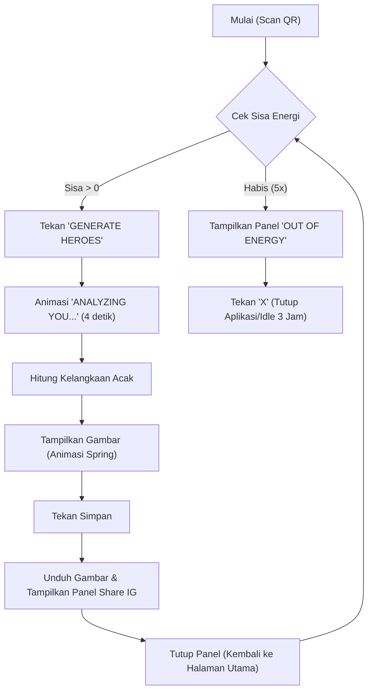

## 1. Ringkasan Produk
Sebuah aplikasi web berbasis seluler untuk mengacak (gacha) gambar "Heroes" dengan berbagai tingkat kelangkaan (Basic, Rare, Mythic, Legend). Aplikasi ini ditujukan bagi pengguna yang mengakses melalui pemindaian QR Code, memberikan pengalaman interaktif dengan animasi, pop-up, dan fitur unduh gambar.

## 2. Fitur Inti

### 2.1 Peran Pengguna (jika ada)
| Peran | Metode Pendaftaran | Izin Inti |
|------|---------------------|------------------|
| Pengguna Umum | Akses langsung (via QR) | Melakukan *generate*, mengunduh gambar, melihat batas energi |

### 2.2 Modul Fitur
1. **Halaman Utama**: Tombol *Generate*, animasi loading, tampilan batas energi.
2. **Halaman Hasil**: Menampilkan gambar hasil gacha, tombol simpan, panel overlay untuk berbagi.

### 2.3 Detail Halaman
| Nama Halaman | Nama Modul | Deskripsi Fitur |
|-----------|-------------|---------------------|
| Halaman Utama | Modul *Generate* | Tombol "GENERATE HEROES" di bagian bawah. Batas maksimal 5 kali percobaan. |
| Halaman Utama | Modul *Loading* | Teks "ANALYZING YOU..." dengan animasi titik yang bertambah (1 hingga 4) berulang selama 4 detik. |
| Halaman Hasil | Tampilan Hasil | Gambar muncul dengan efek *spring pop-up* dari tengah memenuhi layar. Placeholder disiapkan untuk diganti gambar asli. |
| Halaman Hasil | Panel Simpan | Tombol simpan di bawah. Saat ditekan, muncul overlay hitam 50%, teks "share to instagram story and tag @stoneflesh.gs", logo Instagram kecil, dan tombol "X" (tutup) di kanan atas. Mengunduh gambar ke galeri hp. |
| Halaman Utama | Modul Energi Habis | Jika percobaan sudah 5 kali, tampilkan panel "OUT OF ENERGY, TRY SCAN THE QR AGAIN IN 3 HOURS" dengan tombol "X". Menyimpan status tunggu 3 jam di penyimpanan lokal (*localStorage*). Menekan "X" akan membuat web tampak idle/tertutup. |

## 3. Proses Inti
1. Pengguna memindai QR dan masuk ke halaman utama.
2. Pengguna menekan "GENERATE HEROES".
3. Tampil animasi "ANALYZING YOU..." selama 4 detik, sembari sistem mengacak kelangkaan. (Catatan: Persentase pengguna 60,30,15,5 total 110%, disesuaikan proporsional menjadi: Basic ~55%, Rare ~27%, Mythic ~13%, Legend ~5% agar total 100%).
4. Gambar hasil muncul dengan efek *spring* (memenuhi layar).
5. Pengguna menekan logo *Save*, gambar diunduh ke perangkat, dan muncul instruksi *share* ke Instagram.
6. Jika batas 5 kali tercapai, sistem terkunci dan muncul panel peringatan *cooldown* 3 jam.

## 4. Desain Antarmuka Pengguna
### 4.1 Gaya Desain
- **Warna Utama & Sekunder**: Dominan gelap (*dark mode*) agar fokus pada gambar Heroes.
- **Gaya Tombol**: Elegan, modern, *responsive touch*, dan memposisikan interaksi jari pengguna di bagian bawah.
- **Tipografi**: Font bergaya *bold sans-serif* untuk kesan solid dan energik.
- **Gaya Tata Letak**: *Mobile-first* (seukuran layar *smartphone*).
- **Animasi**: Menggunakan Framer Motion untuk transisi *spring* yang mulus dan efek mengetik/titik-titik (*loading dots*).

### 4.2 Ringkasan Desain Halaman
| Nama Halaman | Nama Modul | Elemen UI |
|-----------|-------------|-------------|
| Halaman Utama | Tombol *Generate* | Posisi bawah, ukuran besar. |
| Halaman Utama | *Loading Screen* | Teks di tengah layar, titik bertambah (1-4). |
| Halaman Hasil | *Pop-up* Gambar | Gambar penuh, ikon *save* di bawah. |
| Halaman Hasil | Overlay Simpan | Latar hitam transparan 50% (*alpha*), teks putih kecil, logo Instagram. |

### 4.3 Responsivitas
- **Prioritas Seluler (*Mobile-First*)**: Desain dikhususkan untuk tampilan ponsel pintar, menyesuaikan seluruh rasio layar ponsel (responsif penuh). Pada *desktop*, akan dibatasi lebarnya agar menyerupai layar ponsel.
