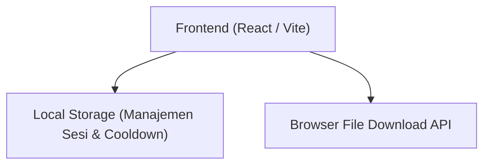

## 1. Desain Arsitektur

## 2. Deskripsi Teknologi
- **Frontend**: React@18 + TailwindCSS@3 + Vite
- **Animasi**: Framer Motion (untuk animasi *spring* gambar, transisi panel, dan animasi *loading dots*)
- **Ikon**: Lucide React (untuk ikon simpan, logo Instagram, dan ikon X/Close)
- **Penyimpanan State**: `localStorage` (untuk menyimpan jumlah *generate* dan waktu kadaluwarsa)
- **Unduhan**: Memanfaatkan elemen anchor `<a>` dengan atribut `download` yang secara otomatis mengunduh *placeholder image* ke galeri perangkat.

## 3. Definisi Rute
| Rute | Tujuan |
|-------|---------|
| `/` | Halaman utama *Single Page Application* (SPA) yang menangani semua status (Home, Loading, Result, Out of Energy) |

## 4. Definisi API (Jika ada backend)
*(Tidak ada backend yang digunakan. Seluruh logika berjalan murni di sisi klien / lokal peramban).*

## 5. Diagram Arsitektur Server
*(Tidak berlaku, aplikasi sisi klien).*

## 6. Model Data
### 6.1 Definisi Model Data
Penyimpanan lokal (`localStorage`) akan mengelola *state* berikut:
- `heroes_generate_count` (Integer): Jumlah gambar yang sudah di-generate. Nilai maksimum adalah 5.
- `heroes_cooldown_until` (Timestamp): Waktu di masa depan (dalam milidetik) yang menunjukkan kapan *cooldown* 3 jam berakhir. Jika waktu saat ini lebih kecil dari nilai ini, aplikasi akan berada dalam mode "Out of Energy".

### 6.2 Logika Probabilitas (Gacha)
Probabilitas disesuaikan ke total 100%:
- `BASIC`: 55%
- `RARE`: 27%
- `MYTHIC`: 13%
- `LEGEND`: 5%

Fungsi *randomizer* akan menghasilkan angka acak antara 1 dan 100, lalu mencocokkannya dengan rentang peluang di atas untuk menentukan tingkat kelangkaan (rarity) gambar.
